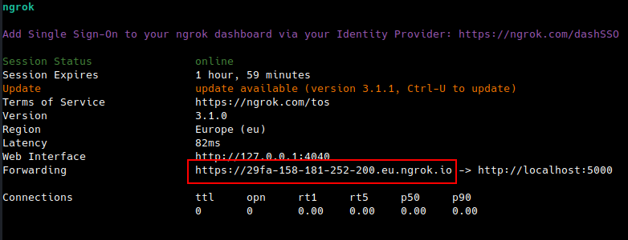
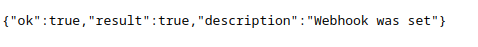

# Webhook telegram bot basic

A basic working code for further development of your Telegram bot using a webhook.

## Before Run

A webhook with an HTTPS protocol is required to run the bot.  

You can use the ngrok service to generate a temporary webhook.  
The URL will be valid for 2 hours, after which you can generate a new one if needed.

* Download and install `ngrok` from the [link](https://ngrok.com/download)  
* Start the service in the console with the command `ngrok http 5000` (the port can be different).  


    


* Set the generated URL in the `application.properties` file. 
* Enter the following in the browser: 
```
https://api.telegram.org/bot{YOUR_BOT_TOKEN}/setWebhook?url=https://29fa-158-181-252-200.eu.ngrok.io
```
* You will receive a response that the webhook has been set.  


  

## Run

Run `WebhookTelegramBotApplication`

## License

This project is Apache License 2.0 - see the [LICENSE](LICENSE) file for details